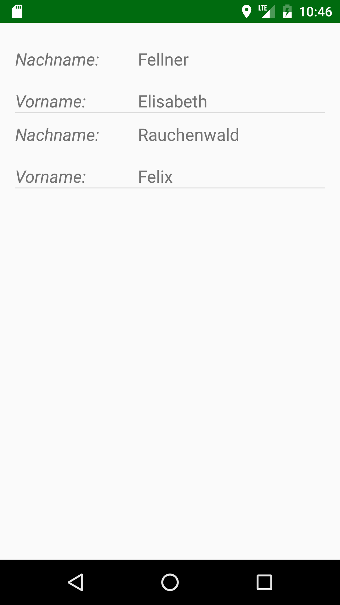

## Registrationform

With the app, you have the possibility to register or check out your residence. This happens through a SQLite database. It is also possible to see a list of all registered residences and furthermore to edit or delete data from the database. It is possible to have two residences, a main and a beside residence. The user just has to go through the wizard and fill in all necessary input fields. There are 6 activities to pass, to finish the registration. It is possible to jump between nearby activities. If data is missing the programme prints a toast which asks the user to enter all the data. Activities that are not needed are automatically skipped for the best possible user experience.
On the Welcome Screen you can choose between making a new registration or to see the list of all registrations done.

When you enter data, you can choose to automatically fill in the address of your current location via GPS and geocoder. To do this you just have to press the button with the current location symbol.

Therefore, you have to add uses permissions in the android manifest.

For showing all entries a listview is used, with clicking on a name you get to the detailed view of the person where it should be possible to edit or delete data.

There is also an About Activity to get information about the developers.

## Prerequisites
- GPS must be activated
- Android API Level 9 - Android 2.3 (Gingerbread)

##Getting Started

## Release
First Release on 06.02.2017

## LICENSE
http://choosealicense.com/licenses/mit/
MIT License was chosen, because we wanted to keep it simple and it is a non-commercial project.
We want to be credited if someone does further development but not be held liable.

## Contributors
Elisabeth Fellner

Philipp Göschl

Felix Rauchenwald

Markus Wolf

