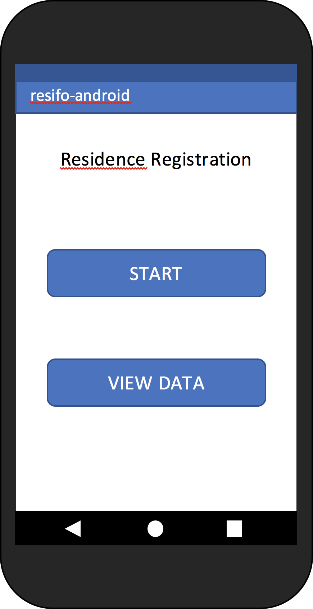
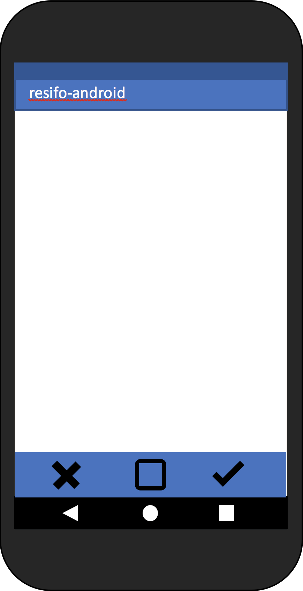
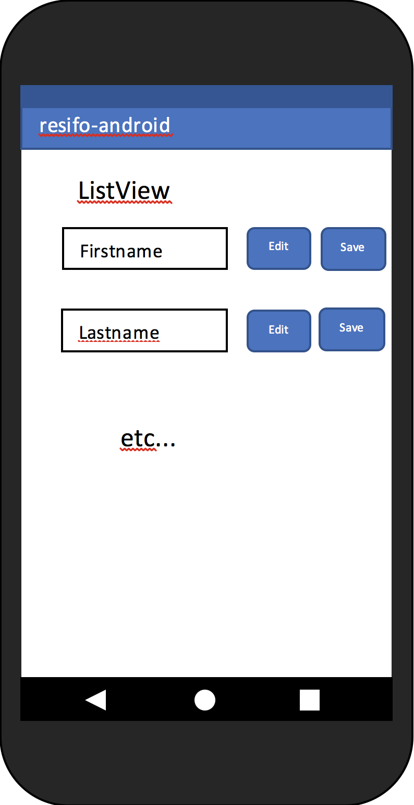

# Proposal / Prototype

## 1 Welcome screen
- Two options (buttons)
  - START -> Wizard like
  - VIEW DATA -> ListView -> only if already data stored from user input

## 2 Edit wizard
Activities based on single edit elements, so user does not have to
scroll down and accidentially hit wrong fields.
Each activity has 3 buttons for enter, home and back at the bottom. Maybe adding a
progress bar for user to see how much is left.

If enter button (check)  
-> save entry in DB  
If back button (X)  
-> overwrite DB entry if TextChanged on next continue  
If home button   
-> back to welcome screen

### Elements chronologicaly

##### Firstname and Lastname
- Check invalid inputs like numbers.

##### Birthdate
- Useage of widget for scrolling the year month and day
so user does not have type manually.

##### Gender
- Usage of 2 radio buttons for male and female.

##### Religion
- Maybe checkbox with pre defined religions and an other-editText.

##### Place of birth
- GEO API

##### Family status
- RadioButtons

##### Citizenship
- ScrollView

### etc...

## 3 ListView

The app also has a listview Activity to show the current status of completion.
It is possible to edit the data directly in the listview or in the wizard.

