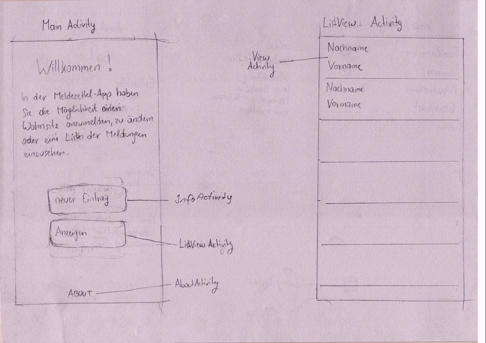
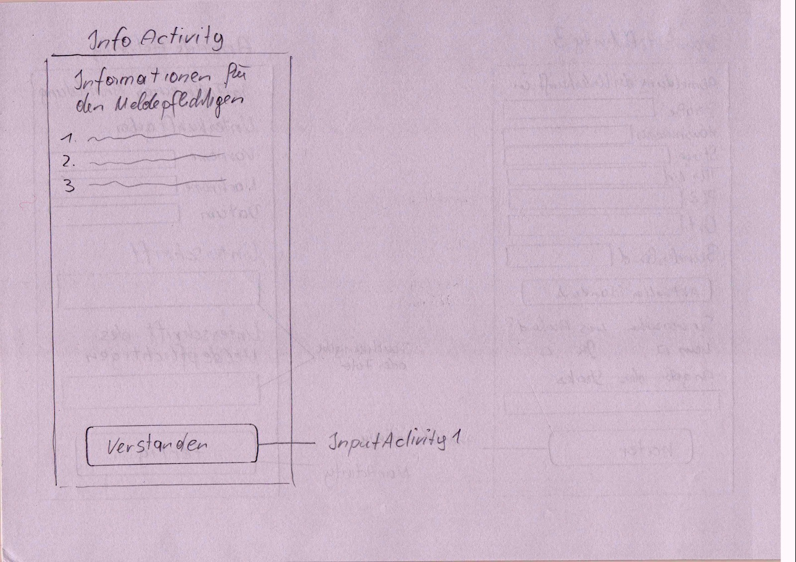
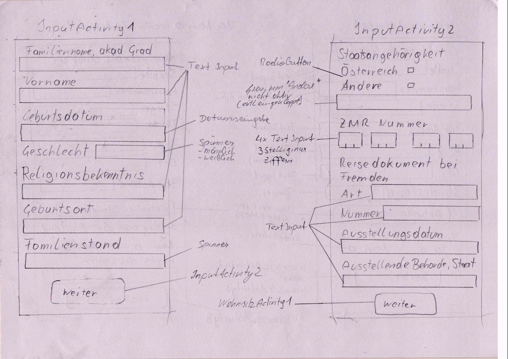
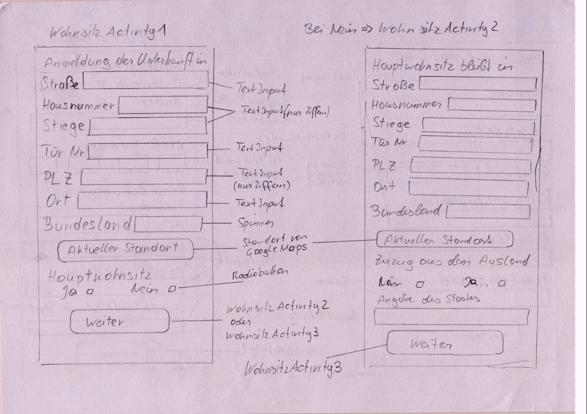
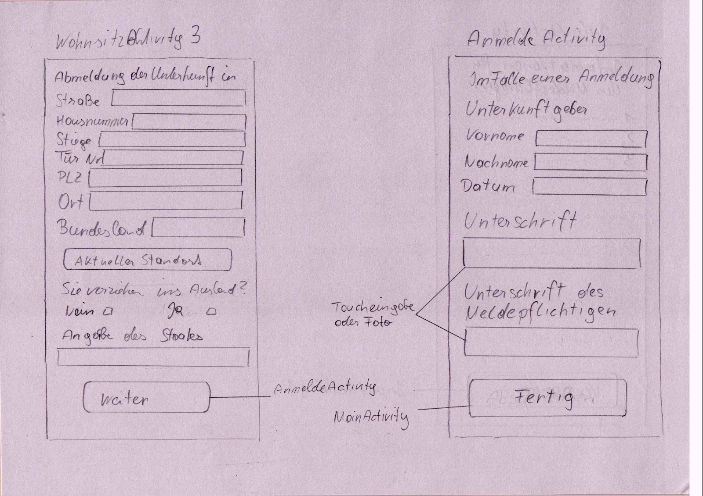

Prototype informations

Requirements:
You have to design a prototype of your app and place it in a pdf named proposal.md in the base of the project directory.
By viewing this md, it should be clear how your application will look like. An estimation on costs should be given
in tabular form which will give an estimation about how long you plan to work on certain aspects of the application.
Think about what your time is worth and give an offer in Euro which describes what a customer would be charged to pay
for your app.

Basic Design of the Frontend:

[Images as PDF](docs/prototype.pdf)

Cost estimation:

For the costs we are calculating a payment of 20€ per hour per person, because we think this is a
realistic value based on previous experiences and considering that a hour of a programmer at an
IT-companycosts about 80-100€, so all 4 of us togehter should be worth at least as much.

The baselayout for our calculations was this  [Application Development Project Work Breakdown Structure](http://www.theprojectdiva.com/application-development-project-work-breakdown-structure/)

* 1.1. Application Development Project Management (4h)
    * 1.1.2. Resource Management Plan 2h
    * 1.1.3. Scope Development 0.5h
    * 1.1.6. Budget 0.5h
    * 1.1.7. Scheduling 0.5h
    * 1.1.8. Document Change Control Processes 0.5h
* 1.2. Application Architecture (22h)
    * 1.2.1. Functional Specifications
        * 1.2.1.1. Process Models 10h
        * 1.2.1.2. User Interface 8h
        * 1.2.1.3. Database Model 4h
* 1.3. Application Development (88h)
    * 1.3.1. Setup Development Environment 8h
    * 1.3.2. UI Development 30h
    * 1.3.3. Code Development 50h
* 1.4. Application Testing (20h)
    * 1.4.1. Test Environment Setup 4h
    * 1.4.2. Unit Testing 10h
    * 1.4.3. Results Reporting 6h
* 1.5. Application Deployment  (8h)
    * 1.5.1. Documentation
        * 1.5.1.1. End User Documentation 8h

Alltogether: 142h
Costs 142h * 20€/h = 2840€
Considering that there might be unexpected problems our proposal would be 3000€ for the whole project.